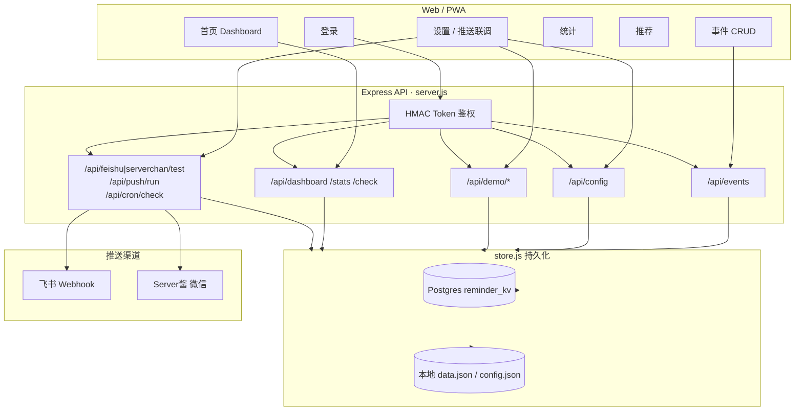
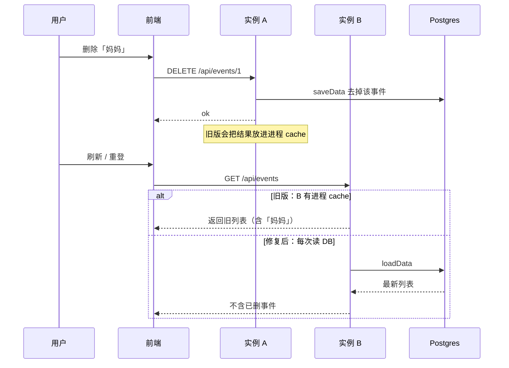
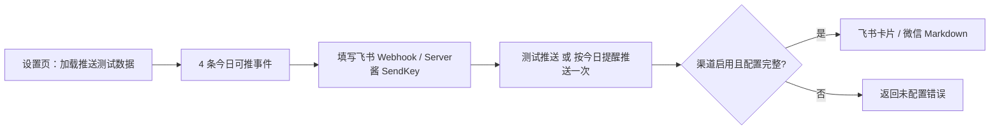

# 日常提醒系统 · 功能流程与优化说明

## 1. 系统功能总览

## 2. 事件删除 / 列表流程（出问题的路径）

**根因（已修）：**
1. `store.js` 进程级 `cache.data`：Fluid/暖实例上 A 删了，B 仍读内存旧数据。  
2. 首次空库自动灌入 `seed.data.json`（含「妈妈」「结婚纪念日」），容易让人以为「删不掉」。  

**修复：** 去掉读缓存；首次建库写入空列表；演示/测试数据改为设置页手动加载。

## 3. 推送联调流程

测试事件（`readPushTestData`）：
| ID | 名称 | 模式 | 用途 |
|----|------|------|------|
| 9001 | 【测试】每日吃药提醒 | daily | 今日必推 |
| 9002 | 【测试】今日生日 | yearly 当天 | 当日消息 |
| 9003 | 【测试】今日缴费 | monthly 当天 | 当日消息 |
| 9004 | 【测试】每日运动 | daily | 双渠道文案 |

## 4. 代码结构与优化点

| 模块 | 职责 | 建议优化 |
|------|------|----------|
| `store.js` | Postgres / 文件存储 | ✅ 已去缓存；可加乐观锁 `updated_at` 防并发覆盖 |
| `server.js` | API + 检查引擎 | 事件表可拆成真正的 `events` 表（当前 JSONB 整包） |
| `public/app.js` | SPA UI | API 失败时统一 toast；删除后强制 `renderView` |
| `checkEvent` | 调度计算 | weekly 需配置 `day_of_week`；单测覆盖边界日 |
| `reminder.js` | CLI 定时 | 与 `/api/cron/check` 共用检查函数，减少双份逻辑 |
| PWA `sw.js` | 静态缓存 | 确保不缓存 `/api/*`（已排除） |

## 5. 运维检查清单

1. Vercel 环境变量：`DATABASE_URL`（Production + Preview）  
2. `/api/health` → `persistence.backend === "postgres"`  
3. 设置页 → 清空全部事件 → 刷新仍为 0  
4. 加载推送测试数据 → 飞书/微信「按今日提醒推送一次」
