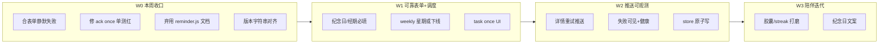

# Nudge v4.2 — 功能 / 迭代 / 优化 / Bug 修复 开发计划

> **For agentic workers:** 按工作流分批执行；每项完成后勾选并回写 `nudge-PRD.md` / `RELEASE.md`。大改动建议用 subagent-driven-development 或 executing-plans。

**Goal:** 在 v4.1.30 功能主干已完成的前提下，收口缺陷与文档漂移，补齐表单/调度可靠性，再择一主轴做陪伴打磨或推送可观测性——产出可发布的 **v4.2.x** 系列小版本。

**Architecture:** 保持 Express + vanilla SPA + `store`（文件/Postgres）+ 飞书长连接；不重做 IA；不引入 Web 助手 Tab；生产路径以 VPS `server.js` 内置调度 + `feishu:ws` 为准。

**Tech Stack:** Node.js、Express、Neon/fs store、飞书开放平台、DeepSeek（env）、Capacitor 壳（可选）

**基线：** `package.json` **4.1.30** · 日期 **2026-07-29** · 关联 PRD：`nudge-PRD.md`

**当前测试：** `npm test` → **86 pass / 1 fail**（`test/ack-deeplink.test.js` once 待办 ack 后 `archived` 未置 true）

---

## Global Constraints

- 品牌：**Nudge** / 副标题「轻推一下，刚好想起」
- DeepSeek Key 仅环境变量 `DEEPSEEK_API_KEY`，禁止写入前端 / Git
- 创建/保存事项 **绝不**自动推送；测试卡标题含 `【连通性测试】`
- 事项通道与热点通道 **分离**；ledger `dedupe_key` 防重
- 推送前跑 secrets-guard；发版更新 `RELEASE.md`
- 禁止整站 UI 重写 / 多租户 SaaS / 医疗级经期算法（本阶段）
- 大文件改动后必须：`npm test` + 确认 `public/app.js` / `engine.js` 行数与关键符号未截断

---

## 0. 现状总览（分析结论）

| 维度 | 判断 |
|------|------|
| 产品阶段 | v4.1 **主干完成**；进入收口 + 陪伴/可靠小迭代 |
| 进度 | P0 9/9；P1 ≈ 11/12；整体约 **97%**（见 PRD） |
| 主风险 | 文档与双路径调度误导运维；表单校验弱；本地 JSON 非原子写；单测 1 红 |
| 代码体量 | `app.js` ~2018 · `server.js` ~1054 · `engine.js` ~814（半迁移 monolith） |
| 方向建议 | **先 Bug/文档 → 再表单可靠 → 再推送可观测 → 最后陪伴打磨** |

---

## 1. Bug 修复清单（按优先级）

### 1.1 P0 — 立即修（阻塞正确性 / 测试门禁）

| ID | 问题 | 证据 | 涉及文件 | 建议版本 | 状态 |
|----|------|------|----------|----------|------|
| **B-01** | 纪念日/经期/习惯创建「点了没反应」：隐藏的 `birth_date` 仍带 HTML5 `required` | commit `389967d`；分支 `feat/fix-create-form-silent-fail` | `public/app.js` | 4.1.31 | [x] |
| **B-02** | `GET /api/ack`：`mode: once` 待办确认后 `archived` 偶发失败（共享 store 竞态） | 加固独立 `DATA_DIR` + 串行 test | `test/ack-deeplink.test.js`、`package.json` | 4.1.31 | [x] |
| **B-03** | 工作区 `engine.js` 仅 CRLF 脏 diff（~867 行伪变更）易误合 | `git diff --stat engine.js` | `engine.js` | — | [x] 已丢弃 |
| **B-04** | 启动日志写死 `Nudge v4.0`，与 `4.1.30` 不一致 | `server.js` ~1098/1108 | `server.js` | 4.1.31 | [x] |

**验收 B-01～B-04：** `npm test` 全绿；创建纪念日/经期/习惯各走一遍有 toast 或成功跳转；启动日志版本 = `package.json`。

#### Task B-02 步骤（once 归档）

- [ ] 写/确认失败用例：`mode:'once'` + ack → `item.archived === true`（已有）
- [ ] 在 ack 路径确认：`space=task` 且 `schedule.mode=once`（或等价）时写 `archived:true`
- [ ] 核对 `GET /api/events/:id/detail` 返回完整 `item`（含 `archived`）
- [ ] `npm test` 全绿后提交

---

### 1.2 P1 — 高优功能 Bug（用户可感知「建了但永不推」）

| ID | 问题 | 根因 | 涉及文件 | 建议版本 | 状态 |
|----|------|------|----------|----------|------|
| **B-05** | 选 `weekly` 但无「星期几」字段 → 引擎要求 `day_of_week` → **永远不 due** | 表单缺字段；`engine.js` weekly 分支 | `public/app.js`、`engine.js` | 4.2.0 | [ ] |
| **B-06** | 纪念日可不填月/日仍保存 → 引擎默认 1/1 或行为怪异 | 表单无 required；服务端只校验 `name` | `app.js`、`server.js` | 4.2.0 | [ ] |
| **B-07** | 经期可不填 `last_start` → `predictPeriod` 空 → **永不提醒** | 同上 | `app.js`、`server.js` | 4.2.0 | [ ] |
| **B-08** | 清单可选 `weekly`，但 IA 待办期望 `once`；表单无 `once`，靠 API 才能建 | UI/规格不一致 | `app.js`、`engine.js` | 4.2.0 | [ ] |
| **B-09** | 年龄展示按「日历年」可能 off-by-one | `app.js` 年龄计算 | `public/app.js` | 4.2.x | [ ] |
| **B-10** | 纪念日农历路径无闰月，与生日不一致 | 表单 anni 仅月日 | `app.js`、`engine.js` | 4.2.x | [ ] |

#### Task B-05 步骤（weekly）

- [ ] 二选一产品决策：**加「星期几」控件** 或 **从表单移除 weekly**（推荐：习惯保留 weekly+星期；待办不提供 weekly）
- [ ] 实现 UI + 提交 `schedule.day_of_week`
- [ ] 单测：weekly + 指定 weekday 在匹配日 `checkEvent` 为 true
- [ ] Commit

#### Task B-06/B-07 步骤（必填）

- [ ] 前端：纪念日 `month_a`/`day_a`、经期 `last_start` 可见时 `required` + 隐藏时取消（同 birth_date 模式）
- [ ] 后端：对应 subtype 缺字段返回 400 + 明确 `error` 文案
- [ ] 单测覆盖 400；手动点提交有 toast
- [ ] Commit

---

### 1.3 P2 — 运维 / 安全 / 双路径风险

| ID | 问题 | 影响 | 涉及文件 | 建议 | 状态 |
|----|------|------|----------|------|------|
| **B-11** | `reminder.js` 为**旧推送路径**（无 ledger、事项+热点易混卡），README 仍教 crontab 跑它 | 与 `server.js` `runScheduledPush` 双跑 → 重复/错误推送 | `reminder.js`、`README.md`、`package.json` | 标记 deprecated；README 改为 PM2/`/api/cron/check`；可选让 `npm run reminder` 调用同一套引擎 | [ ] |
| **B-12** | `store.writeJSONFile` 直接 `writeFileSync`，非原子 | 崩溃可损坏 `data.json` | `store.js` | temp + rename；可选串行化 save | [ ] |
| **B-13** | 默认 HMAC `reminder-hmac-v1-change-me` | 未设 `TOKEN_SECRET` 时可伪造 ack | `middleware/auth.js`、`engine.js` | 生产强制 env；健康检查标红 | [ ] |
| **B-14** | 调度首 tick `runScheduledPush().catch(() => {})` 吞错 | 启动失败无日志 | `server.js` | 至少 `console.error` | [ ] |
| **B-15** | Server酱/部分文案仍「日常提醒」「提醒系统」 | 品牌不一致 | `engine.js`、`routes/push.js` | 统一 Nudge | [x] |

---

## 2. 迭代需求（产品功能，按版本切片）

### 2.1 v4.1.31 — 收口补丁（不扩功能）

**主题：** 修已知洞 + 文档对齐，可随时发。

| 项 | 类型 | 说明 | 验收 |
|----|------|------|------|
| 合 B-01 | Bug | 表单静默失败 | 纪念日/经期创建成功 |
| 修 B-02 | Bug | once ack 归档 | 单测绿 |
| B-03/B-04/B-15 部分 | Chore | 脏文件、版本日志、品牌字符串 | 无 CRLF 噪声；日志正确 |
| README 首屏 | Docs | 改为 Nudge 4.1：space、Tab、VPS 部署、废弃旧 9 类型叙述 | 新人按 README 能跑通 |

### 2.2 v4.2.0 — 可靠创建与调度语义

**主题：**「建了就会在对的时间响」。

| ID | 需求 | 优先级 | 依赖 | 状态 |
|----|------|--------|------|------|
| **I-01** | 表单校验闭环（B-05～B-08） | P0 | B-01 | [ ] |
| **I-02** | 待办支持「仅一次 once」：创建 UI + ack 归档 + 清单归档区 | P0 | B-02 | [ ] |
| **I-03** | 详情页「重试推送」按钮（规格 §5.3 / PRD P2-6） | P1 | ledger API | [ ] |
| **I-04** | 设置页 / health：最近失败推送摘要（条数、最后错误） | P1 | ledger | [ ] |
| **I-05** | 明确文档：生产只用内置 scheduler；禁止并行 `reminder.js` | P0 | B-11 | [ ] |

**不做（本版本）：** `next_run_at` 大改造（规格有、现网用 minute window + ledger 已够用；单独评估后再开 Spike）。

### 2.3 v4.2.1+ — 轻陪伴打磨（择优，每次 1～2 点）

近期发版轨迹（4.1.26→30）已定调；本切片只做**体验闭环**，不开新大模块。

| ID | 需求 | 说明 | 验收 | 状态 |
|----|------|------|------|------|
| **I-10** | 时间胶囊入口强化 | 生日/纪念日详情更明显；推送日带回去年的话（已有逻辑）走查 | 封存 → 次年当天卡可见 | [ ] |
| **I-11** | Streak 断签挽回 | 未确认时「续上」文案更醒目；飞书今日事项已有天数则对齐 | 断一天有提示 | [ ] |
| **I-12** | 纪念日专属暖文案 | 对标生日/经期；可选 DeepSeek 或本地模板 | 纪念日推送卡有分区 | [ ] |
| **I-13** | 今日页「确认收到」是否恢复 | IA 曾要求 Web 主按钮；现产品刻意飞书为主——**需产品确认**后再做 | 二选一写进 PRD | [ ] |

### 2.4 v4.3 / v5 候选（暂缓，仅登记）

| ID | 需求 | 条件 |
|----|------|------|
| **I-20** | 关键词订阅聚合 | 有明确 RSS/源不够用的痛点 |
| **I-21** | 安卓系统本地通知 | 「离开飞书也要震」成为刚需 |
| **I-22** | `next_run_at` 精确推进模型 | 分钟窗口误推/漏推有实测证据 |
| **I-23** | Web 助手 Tab | 明确否定飞书主路径时再议 |
| **I-24** | 多用户 / SaaS | 超出私人助手范围 |

---

## 3. 优化需求（非功能）

### 3.1 可靠性 / 数据

| ID | 优化 | 做法 | 收益 | 状态 |
|----|------|------|------|------|
| **O-01** | 原子写本地 JSON | `write tmp` → `rename`；可选单飞队列 | 防损坏 | [ ] |
| **O-02** | save 串行化 | 同一进程内 mutex 包 `saveData` | 防 cron+ack 竞态 | [ ] |
| **O-03** | 生产强制 `TOKEN_SECRET` | 未设置则 health=`degraded` 或拒绝启动（可配置宽松本地） | 防伪造 ack | [ ] |
| **O-04** | 版本单一真源 | `package.json` → health / SW CACHE / `?v=` / boot log | 少漏改 | [ ] |

### 3.2 可观测 / 运维

| ID | 优化 | 做法 | 状态 |
|----|------|------|------|
| **O-10** | 调度错误可见 | 去掉空 `catch`；可选写 history | [ ] |
| **O-11** | 推送失败聚合 | `/api/health` 或设置页展示最近 N 条 `status=failed` | [ ] |
| **O-12** | 飞书入口单一文档 | 标明 VPS=`feishu:ws`；Vercel event 仅备用/注明限制 | [ ] |

### 3.3 架构 / DX（不阻塞发版）

| ID | 优化 | 说明 | 状态 |
|----|------|------|------|
| **O-20** | 继续拆 `server.js` | ack / dashboard / capsule 路由文件化 | [ ] |
| **O-21** | 拆 `public/app.js` | 至少 `form.js` / `today.js` / `detail.js`（无打包器则用多 script 或谨慎拆） | [ ] |
| **O-22** | 去重 lunar | 前端与 `lib/lunar.js` 对齐或共享生成 | [ ] |
| **O-23** | 去重 Feishu pending/ack | `server.js` 与 `feishu-event-http.js` 共用模块 | [ ] |
| **O-24** | Digest 源冷却 | 防手动推+定时双重打穿 RSS | [ ] |
| **O-25** | 废弃或薄封装 `reminder.js` | 调用 `runScheduledPush` 或删脚本改 README | [ ] |

### 3.4 文档债（必做低成本）

| ID | 文档 | 动作 | 状态 |
|----|------|------|------|
| **O-30** | `README.md` | 重写为 Nudge 4.1（space、飞书 WS、VPS:9999、Postgres 可选） | [x] |
| **O-31** | `docs/SYSTEM-FLOW.md` | 更新架构图；去掉「9 类型」心智 | [ ] |
| **O-32** | `docs/superpowers/plans/2026-07-27-nudge-v4.0.md` | 勾选已完成 T1–T4 或标「已由 4.1.x 吸收」 | [ ] |
| **O-33** | 本计划 + PRD | 每发一版回写 checkbox | [ ] |

---

## 4. 功能缺口对照（规格 vs 现状）

| 规格来源 | 要求 | 现状 | 计划动作 |
|----------|------|------|----------|
| v4 design §7 | `next_run_at` 推进 | 未实现；用窗口+ledger | **暂缓**（I-22 Spike） |
| v4 design §5.3 | 失败可重试推送 | 时间轴有失败点，无按钮 | **I-03** |
| v4.1 IA §5–6 | 今日大按钮确认 | 飞书为主，Web 弱化 | **I-13 产品确认** |
| v4.1 IA | task once | API/测例有，表单无 | **I-02** |
| v4 §10 | hn / keywords 目录 | 部分 RSS+GH+学习 | **I-20 暂缓** |
| v4 §11 | Web+飞书问答 | 飞书已做；Web 助手删除 | 维持 |
| PRD P1-12 | 表单静默失败 | 分支已修 | **合入 4.1.31** |

---

## 5. 建议迭代排期

| 周次 | 版本目标 | 必做 | 可选 |
|------|----------|------|------|
| **W0** | **4.1.31** | B-01～B-04、B-02 单测绿、O-30 README 最小改、合 PR | B-15 品牌串 |
| **W1** | **4.2.0-alpha** | I-01 表单、I-02 once、I-05 弃用旧 cron 文档 | O-01 原子写 |
| **W2** | **4.2.0** | I-03 重试、I-04/O-11 失败可见、O-10 日志 | O-03 TOKEN |
| **W3** | **4.2.1** | I-10～I-12 中选 1～2 个陪伴项 | O-20 小拆分 |

每次发版：`RELEASE.md` 一行 + secrets-guard + `npm test` 全绿。

---

## 6. 文件归属（改哪里）

| 区域 | 主文件 | 测试 |
|------|--------|------|
| 表单 / 今日 / 详情 UI | `public/app.js`、`public/styles.css`、`public/index.html` | 手工 + 必要时补 API 测 |
| 调度 / ack / 卡片 | `engine.js`、`ledger.js` | `test/scheme-b-engine.test.js`、`ledger.test.js`、`ack-deeplink.test.js` |
| HTTP / 定时推送 | `server.js`、`routes/push.js` | `test/cache-and-demo.test.js`、`auth-and-events.test.js` |
| 持久化 | `store.js` | `durable-store.test.js`、`seed-array-persist.test.js` |
| 飞书 | `feishu-ws.js`、`feishu-bot.js`、`feishu-event-http.js`、`feishu-doc.js` | `feishu-*.test.js` |
| 陪伴 | `lib/period-care.js`、`lib/comfort.js`、`lib/streak.js`、`lib/capsule.js` | 对应 `test/*.js` |
| 遗留 CLI | `reminder.js` | 改为委托或删除后更新 README |

---

## 7. 执行检查清单（每个 Task 通用）

1. 从最新 `master` 拉 `fix/*` 或 `feat/*` 分支（勿直接堆 main）
2. 先补/跑相关测试（红）→ 最小改动 → 绿
3. 改 `app.js`/`engine.js` 后确认文件未截断（行数、关键函数名）
4. 更新 `RELEASE.md`（若发版）与本文件 checkbox
5. 回写 `nudge-PRD.md` 对应行

---

## 8. 明确不做（防范围膨胀）

- 整站视觉重设计 / 再引入仪表盘四宫格
- 多租户、权限角色、商店上架级原生 App
- 把 Vercel 重新变成主部署（文档可保留兼容说明）
- 一次性拆完 `app.js` 2000 行（仅随功能顺带抽）

---

## 9. 关联文档

| 文档 | 路径 |
|------|------|
| 产品进度 | `nudge-PRD.md` |
| 发版 | `RELEASE.md` |
| v4 规格 | `docs/superpowers/specs/2026-07-27-reminder-v4-design.md` |
| v4.1 IA | `docs/superpowers/specs/2026-07-27-nudge-v4.1-ia.md` |
| 重构审查（历史债） | `docs/superpowers/reviews/2026-07-27-codex-refactor-review.md` |
| 本计划 | `docs/superpowers/plans/2026-07-29-nudge-v4.2-roadmap.md` |

---

## 10. 下一步（人工确认门禁）

请回复偏好（可多选），便于直接开工：

1. **只发 4.1.31**（合表单修复 + 修 ack 单测 + README/版本串）
2. **直接开 4.2.0**（表单必填 + weekly/once + 推送重试）
3. **优先陪伴**（胶囊/streak/纪念日文案，可靠性稍后）
4. **优先数据可靠**（原子写 + TOKEN_SECRET + 弃用 reminder.js）
