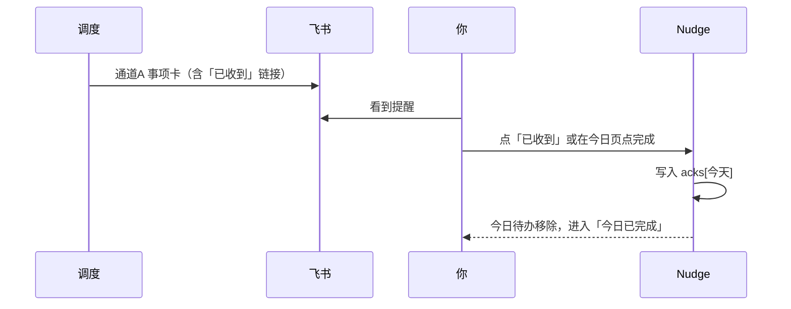

# Nudge v4.1 — 信息架构与流程重梳

**日期:** 2026-07-27  
**状态:** v4.1a/b 已落地（前端体验 + space/ack/分通道）  
**背景:** 推送已通；用户反馈：事项/热点应分通道；长期+临时与三主题不协调；推送后需确认收到并移出今日；前端仍不满意。

---

## 1. 当前问题（诊断）

| 问题 | 原因 |
|------|------|
| 「三主题 × 长期/临时」别扭 | 两套分类叠在一起：主题=调度逻辑，长期/临时=组织方式，新增时认知打架 |
| 事项和热点挤在一张飞书卡 | 推送引擎把 due items + digest 合并成一条 |
| 推了仍挂在「今日」 | 只有「是否到期」，没有「今日是否已确认/完成」状态 |
| 前端仍像设置面板 | Tab 按功能堆，不是按「今天要干什么」组织 |

---

## 2. 核心心智模型（推荐）

用 **三个「清单空间」+ 一个「订阅频道」**，取消「类型芯片 + 分类下拉」的双重选择。

```
Nudge
├── 今日（行动面）     ← 只关心：今天要确认什么
├── 清单（管理面）
│   ├── 习惯 Habits      每天/每周重复（学习、吃药）
│   ├── 日子 Moments     生日、经期、纪念日
│   └── 待办 Tasks       临时一次/短期
├── 订阅 Digest          热点（与事项完全独立）
├── 助手
└── 我的
```

### 新增改为「先选空间」

| 你点什么 | 系统理解 | 背后调度 |
|----------|----------|----------|
| **+ 习惯** | 长期重复 | daily / weekly + 时刻 |
| **+ 日子** | 人生节点 | 再选：生日 / 经期 / 纪念日（yearly 或 cycle） |
| **+ 待办** | 临时事项 | once 或短周期 + 可选截止日期 |

这样前端不再同时出现「生日/经期/自定义」和「长期/临时」——**空间 = 分类，主题藏在「日子」里**。

---

## 3. 数据模型（优雅版）

```json
{
  "id": 12,
  "space": "habit | moment | task",
  "subtype": "birthday | period | anniversary | null",
  "name": "每日学习",
  "enabled": true,
  "schedule": { "mode": "daily", "time": "08:00" },
  "content": { "summary": "开始今日学习" },
  "acks": { "2026-07-27": { "at": "...", "via": "feishu|app" } }
}
```

| 字段 | 含义 |
|------|------|
| `space` | 清单空间：habit / moment / task（唯一组织维度） |
| `subtype` | 仅 moment 需要：birthday / period / anniversary |
| `acks[date]` | 该日已确认收到/完成 → **今日列表移除** |

迁移：现有 `type=birthday|period` → `space=moment`；`custom + long_term` → `habit`；`custom + temporary` → `task`。

---

## 4. 推送：两通道分离（你已确认）

| 通道 | 触发 | 卡片标题示例 | 内容 |
|------|------|--------------|------|
| **A. 事项** | 各事项自己的 `HH:mm` | `Nudge · 今日事项` | 仅习惯/日子/待办 |
| **B. 热点** | 订阅页的 Digest 时刻 | `Nudge · 每日热点` | 仅 GitHub/新闻/学习等 |

规则：

- **绝不**再把事项和热点塞进同一张卡  
- 各自独立 `dedupe_key`、独立推送记录  
- DeepSeek：事项卡写关怀文案；热点卡写项目/新闻简介（可后续）

---

## 5. 「确认收到 → 移出今日」流程



### 完成语义

| 空间 | 确认后 | 明天 |
|------|--------|------|
| 习惯 | 今日消失 | 自动再出现 |
| 日子 | 今日消失 | 按周期/日期再出现 |
| 待办 | 今日消失；可选「完成后归档」 | 不再出现（once） |

### 确认入口（两处都要有）

1. **飞书卡片按钮** → 打开 `APP_URL/?ack=ID&date=今天`（签名 token 防刷）  
2. **今日页大按钮「确认收到」**（主路径，不依赖飞书回调能力）

---

## 6. 前端页面（重做方向）

### 今日（首屏只干一件事）

- 上：日期 + 一句副标题  
- 中：**待确认** 大卡片列表（名称、时刻、一句话、主按钮「确认收到」）  
- 下：折叠 **已完成**  
- 空状态：「今天都搞定了」  
- 不在今日堆统计四宫格、不在今日塞热点预览

### 清单

- 顶部分段：`习惯 | 日子 | 待办`  
- 每段卡片流 + 批量管理  
- FAB：根据当前分段默认「新增该空间」

### 订阅

- 仅热点源与 Digest 时刻  
- 预览区与事项 UI 视觉区分（例如左侧色条不同）

### 视觉

- 少 Tab 内容重复；卡片间距统一；今日主按钮用 CTA 琥珀  
- 事项卡 / 热点卡在飞书用不同 header 色（事项青绿、热点琥珀）

---

## 7. 建议落地顺序

| 版本 | 内容 |
|------|------|
| **v4.1a** | 推送拆通道；今日确认/ack；今日页只保留待确认+已完成 |
| **v4.1b** | space 模型 + 新增改「习惯/日子/待办」；清单三分段 |
| **v4.1c** | 飞书卡「已收到」深链；DeepSeek 丰富事项/热点文案 |

---

## 8. 待你确认

回复例如：

- `确认，按 v4.1 做`  
- 或改点：例如「待办不要归档、只要当日隐藏」等
